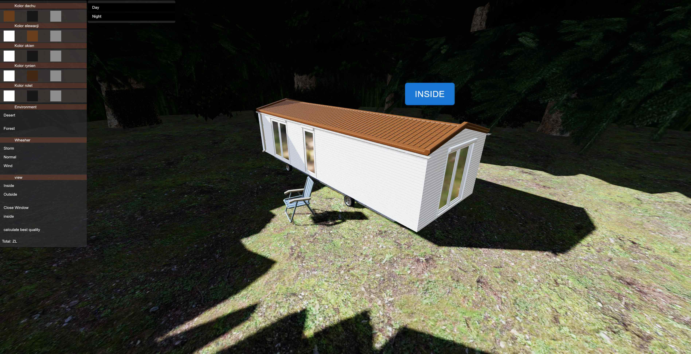
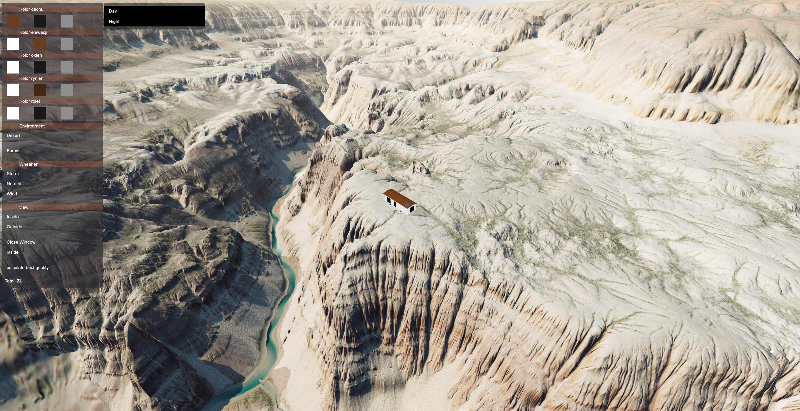

# 🏠 ThreeJS-MobileHouse-Configurator

## Introduction
Welcome to the ThreeJS-MobileHouse-Configurator repository! This project offers an immersive experience with a 3D mobile house configurator, powered by Three.js. Users can unleash their creativity by customizing the house's colors, interior, and exterior environments. Additionally, they can control window openings and select various weather conditions for realistic simulations.

## Getting Started
To embark on this interactive journey, follow these simple steps:

1. **Clone the repository** to your local machine:
    ```bash
    git clone https://github.com/yourusername/ThreeJS-MobileHouse-Configurator.git
    ```

2. **Navigate to the project directory**:
    ```bash
    cd ThreeJS-MobileHouse-Configurator
    ```

## Preview
Experience the configurator's magic through this captivating GIF:


## Screenshots
Explore snapshots of the configurator in action:

1. 
2. 

